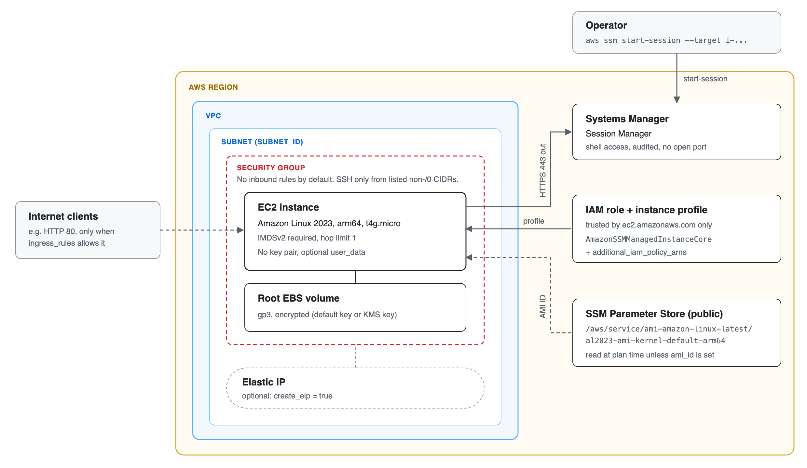
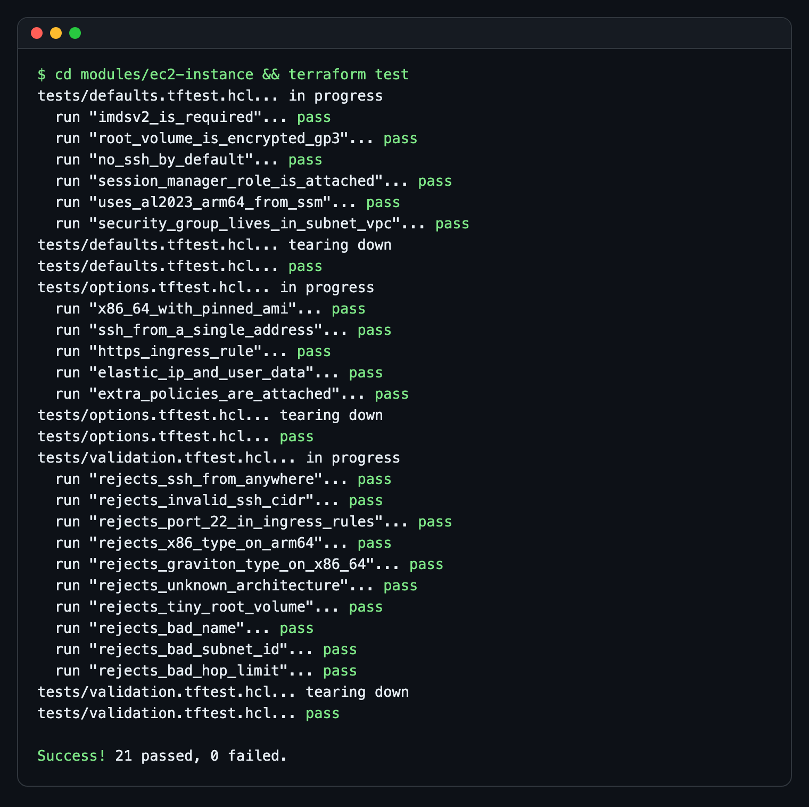
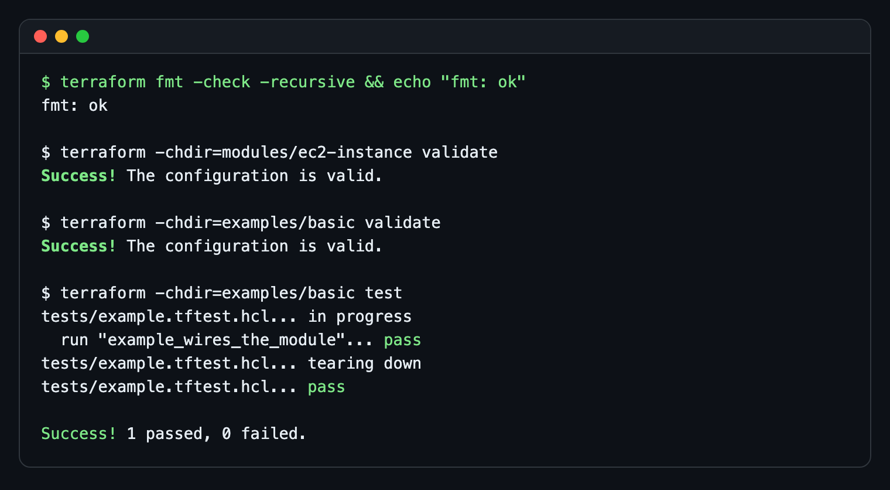

# AWS EC2 Terraform Blueprint

[](https://github.com/jovanshernandez/aws-ec2-terraform-blueprint/actions/workflows/ci.yml)

A reusable Terraform module that launches a single EC2 instance with secure defaults: Amazon Linux 2023 on Graviton, IMDSv2 required, an encrypted gp3 root volume, and shell access through SSM Session Manager instead of SSH. Inputs are validated so unsafe settings, such as SSH open to `0.0.0.0/0`, fail at plan time. The module ships with `terraform test` suites that run against a mocked AWS provider, so CI checks every security default without AWS credentials.





## Features

- **Reusable module** in `modules/ec2-instance`, with a runnable root configuration in `examples/basic`.
- **Current AMI without hardcoded IDs.** The latest Amazon Linux 2023 image is read from the public SSM parameter for the chosen architecture. Pin `ami_id` to opt out.
- **Session Manager access.** The module creates an IAM role and instance profile with `AmazonSSMManagedInstanceCore`. No key pair and no inbound port are needed to get a shell.
- **Closed by default.** The security group has no inbound rules unless you add them. SSH is opt-in and rejects any `/0` range.
- **Validated inputs.** Names, subnet IDs, CIDRs, volume size, hop limit and instance type are checked. The instance type must match the architecture (Graviton types for `arm64`).
- **Optional extras:** Elastic IP, cloud-init `user_data`, application ingress rules, extra IAM policies, a customer-managed KMS key for the root volume.
- **Tests and CI.** `terraform test` with `mock_provider "aws"`, plus `fmt`, `validate` and `tflint` in GitHub Actions on Terraform 1.9 and 1.16.

## Security defaults

| Setting | Default | How to change |
| --- | --- | --- |
| Instance metadata | IMDSv2 required (`http_tokens = "required"`), hop limit 1 | `metadata_hop_limit` (IMDSv2 stays required) |
| Root volume | gp3, encrypted with the account's default EBS key | `root_volume_kms_key_id`, `root_volume_size` |
| Shell access | SSM Session Manager via instance profile | `additional_iam_policy_arns` adds policies |
| SSH | No rule, no key pair | `ssh_ingress_cidrs` (no `/0` allowed) and `key_name` |
| Other inbound traffic | None | `ingress_rules` (port 22 rejected here) |
| Public IP | Not assigned | `associate_public_ip_address`, `create_eip` |
| Outbound traffic | All ports to `0.0.0.0/0` (needed for SSM and package mirrors) | `egress_cidr` |
| AMI updates | New AL2023 releases do not replace running instances | Set `ami_id` or replace the instance on purpose |

## Quick start

Requirements: Terraform 1.9 or later. AWS credentials are needed only for `plan` and `apply`.

```bash
git clone https://github.com/jovanshernandez/aws-ec2-terraform-blueprint.git
cd aws-ec2-terraform-blueprint

# Run the tests (no AWS account needed)
terraform -chdir=modules/ec2-instance init -backend=false
terraform -chdir=modules/ec2-instance test
```

### Use the module

```hcl
module "web" {
  source = "github.com/jovanshernandez/aws-ec2-terraform-blueprint//modules/ec2-instance"

  name      = "orders-api"
  subnet_id = "subnet-0123456789abcdef0"

  # Defaults: t4g.micro, arm64, 20 GiB encrypted gp3, IMDSv2, no inbound rules.
  ingress_rules = {
    https = { from_port = 443, to_port = 443, cidr_ipv4 = "10.0.0.0/16" }
  }
}

output "connect" {
  value = module.web.ssm_start_session_command
}
```

Set org-wide tags with the provider's `default_tags`; the module only adds a `Name` tag and whatever you pass in `tags`.

### Deploy the example

`examples/basic` launches one `t4g.micro` in the account's default VPC with an Elastic IP and nginx installed by user data. This creates billable resources and needs AWS credentials with EC2 and IAM permissions.

```bash
cd examples/basic
cp terraform.tfvars.example terraform.tfvars   # set aws_profile, region, http_ingress_cidr
terraform init
terraform plan -out=tfplan
terraform apply tfplan

# Open a shell without SSH (requires the Session Manager plugin for the AWS CLI)
$(terraform output -raw ssm_start_session_command)

terraform destroy
```

The example uses local state. For shared use, add a remote backend (for example S3 with `use_lockfile = true`).

## Inputs

| Name | Type | Default | Description |
| --- | --- | --- | --- |
| `name` | `string` | required | Name tag and prefix for the security group and IAM role. 3-40 chars, lowercase, digits, hyphens. |
| `subnet_id` | `string` | required | Subnet to launch into. The security group is created in its VPC. |
| `architecture` | `string` | `"arm64"` | `arm64` or `x86_64`. Selects the AL2023 SSM parameter. |
| `instance_type` | `string` | `"t4g.micro"` | Must match `architecture`. |
| `ami_id` | `string` | `null` | Pin an AMI instead of reading the latest AL2023 from SSM. |
| `root_volume_size` | `number` | `20` | Root volume size in GiB, 8-1024. |
| `root_volume_kms_key_id` | `string` | `null` | KMS key ARN for the root volume. |
| `metadata_hop_limit` | `number` | `1` | IMDSv2 hop limit, 1-64. Use 2 if containers need metadata. |
| `associate_public_ip_address` | `bool` | `false` | Assign a public IPv4 address. |
| `create_eip` | `bool` | `false` | Allocate and associate an Elastic IP. |
| `ingress_rules` | `map(object)` | `{}` | Inbound rules: `from_port`, `to_port`, `cidr_ipv4`, optional `ip_protocol` (`tcp`) and `description`. Port 22 is rejected. |
| `ssh_ingress_cidrs` | `list(string)` | `[]` | CIDRs allowed on port 22. Empty means no SSH. `/0` ranges are rejected. |
| `key_name` | `string` | `null` | EC2 key pair, only useful with `ssh_ingress_cidrs`. |
| `egress_cidr` | `string` | `"0.0.0.0/0"` | Outbound destination for all ports. |
| `user_data` | `string` | `null` | Cloud-init user data, max 16 KB. Changing it replaces the instance. |
| `additional_iam_policy_arns` | `set(string)` | `[]` | Extra managed policies for the instance role. |
| `detailed_monitoring` | `bool` | `false` | 1-minute CloudWatch metrics. |
| `termination_protection` | `bool` | `false` | EC2 API termination protection. |
| `tags` | `map(string)` | `{}` | Tags added to every resource. |

## Outputs

| Name | Description |
| --- | --- |
| `instance_id` | EC2 instance ID. |
| `instance_arn` | EC2 instance ARN. |
| `ami_id` | AMI the instance was launched from. |
| `private_ip` | Private IPv4 address. |
| `public_ip` | Elastic IP if created, otherwise the instance public IP (empty if none). |
| `security_group_id` | Security group ID. |
| `iam_role_name` | Instance role name, for attaching more policies from the caller. |
| `iam_role_arn` | Instance role ARN. |
| `instance_profile_name` | Instance profile name. |
| `ssm_start_session_command` | `aws ssm start-session --target <id>` for the instance. |

## Design notes

- **Session Manager over SSH.** Access is controlled by IAM and logged, there is no key to rotate, and the instance needs no inbound port. The trade-off is that the instance must reach the SSM endpoints: through a public IP, a NAT gateway, or SSM VPC interface endpoints (in which case `egress_cidr` can be narrowed to the VPC CIDR).
- **AMI from SSM, then ignored.** Reading `/aws/service/ami-amazon-linux-latest/...` keeps new instances current without hardcoding region-specific IDs. `ignore_changes = [ami]` stops a new AL2023 release from replacing a running instance on the next apply; rolling forward is a deliberate step.
- **Standalone security group rules.** Rules use `aws_vpc_security_group_ingress_rule` / `egress_rule`, one resource per rule, which avoids the inline-rule drift and diff noise of the older `ingress {}` blocks.
- **Cross-variable validation.** The instance type check references `var.architecture`, which needs Terraform 1.9. That catches an x86 type on an arm64 AMI at plan time instead of as a launch error.
- **No provider block in the module.** Region, credentials and `default_tags` belong to the caller; the example shows the expected provider setup.
- **Lock files.** `.terraform.lock.hcl` is not committed. The module should not pin provider builds for its callers, and the example is meant to be copied into a project that owns its own lock file.

## Testing

Tests live in `modules/ec2-instance/tests` and `examples/basic/tests`. They use `mock_provider "aws"` with fixed values for the data sources (partition, subnet VPC, AMI parameter), so they run offline and make no AWS calls.

| Suite | Checks |
| --- | --- |
| `defaults.tftest.hcl` | IMDSv2 required, encrypted gp3 root, no ingress rules or public IP, SSM core policy and EC2-only trust, AL2023 arm64 parameter, security group in the subnet's VPC |
| `options.tftest.hcl` | x86_64 with pinned AMI, SSH from one address, app ingress, Elastic IP and user data, extra IAM policies |
| `validation.tftest.hcl` | `expect_failures` for SSH from `0.0.0.0/0`, invalid CIDRs, port 22 in `ingress_rules`, architecture/type mismatches, bad names, subnet IDs, volume size and hop limit |
| `examples/basic/tests/example.tftest.hcl` | The example wires the module outputs (URL, Session Manager command) correctly |

```bash
terraform fmt -check -recursive
terraform -chdir=modules/ec2-instance init -backend=false
terraform -chdir=modules/ec2-instance validate
terraform -chdir=modules/ec2-instance test
terraform -chdir=examples/basic init -backend=false
terraform -chdir=examples/basic validate
terraform -chdir=examples/basic test
```



CI (`.github/workflows/ci.yml`) runs the same commands on Terraform 1.9.8 and 1.16.0, plus `tflint` with the bundled Terraform ruleset.

## Project layout

```text
.
├── modules/ec2-instance/        # the reusable module
│   ├── main.tf                  # AMI lookup, IAM role, security group, instance, EIP
│   ├── variables.tf             # inputs with validation
│   ├── outputs.tf
│   ├── versions.tf
│   └── tests/                   # terraform test suites (mocked provider)
├── examples/basic/              # root configuration that calls the module
│   ├── main.tf
│   ├── variables.tf
│   ├── outputs.tf
│   ├── versions.tf              # provider with default_tags
│   ├── terraform.tfvars.example
│   └── tests/
├── docs/
│   ├── architecture.html        # source for the diagram
│   └── images/
├── .tflint.hcl
└── .github/workflows/ci.yml
```
